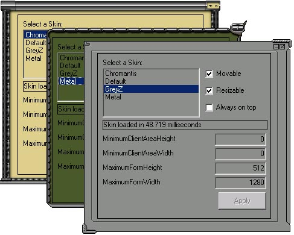



## Enhanced version of Elad Rosenheim's "Dynamic" Resizable Skin Demo

### Description

I have enhanced <a href="http://www.planet-source-code.com/xq/ASP/txtCodeId.23881/lngWId.1/qx/vb/scripts/ShowCode.htm">Elad Rosenheim's "Dynamic" Resizable Skin Demo</a> to better support KewlPad skins as well as added several functionality changes to bring it closer to a complete skinnable solution.

Changes: 

- All the code was removed from the form's codebase and put into a Class Module to make it reusable and easily compiled into an ActiveX DLL.&nbsp; 

- Allow for A Minimum Client Area size&nbsp; 

- Allow for Maximum Form Size 

- Ability to make the form non-movable, non-resizeable, and/or Always OnTop.&nbsp; 

- Removed the need to have a second "Hidden form" for correct Minimize events.&nbsp; 

- Built in routine will reconfigure form using API calls and remove the titlebar and 3D effects, so you don't have to change the form's BorderStyle in the IDE. 

- Added several events triggered when the form skinning is complete, The Minimum button was clicked, the Close button was clicked, ClientArea and Form MouseEvents, and of course on Form Resize. 

- New Skin properties: FontColor, FontBold, BackColor. 

 

Over 50 KewlPad skins are available at 

http://www.deviantart.com/browse/?section=kewlpad 

 

*Please ask the original Skin author for permission before distributing there skins with your app. 
 
### More Info
 

             |
---                |---
**Submitted On**   |2001-09-03 13:19:14
**By**             |[Howard D\. Hull Jr\.](https://github.com/Planet-Source-Code/PSCIndex/blob/master/ByAuthor/howard-d-hull-jr.md)
**Level**          |Intermediate
**User Rating**    |4.8 (53 globes from 11 users)
**Compatibility**  |VB 6\.0
**Category**       |[Custom Controls/ Forms/  Menus](https://github.com/Planet-Source-Code/PSCIndex/blob/master/ByCategory/custom-controls-forms-menus__1-4.md)
**World**          |[Visual Basic](https://github.com/Planet-Source-Code/PSCIndex/blob/master/ByWorld/visual-basic.md)
**Archive File**   |[Enhanced v25855932001\.zip](https://github.com/Planet-Source-Code/howard-d-hull-jr-enhanced-version-of-elad-rosenheim-s-dynamic-resizable-skin-demo__1-26941/archive/master.zip)

### API Declarations

Some :)

